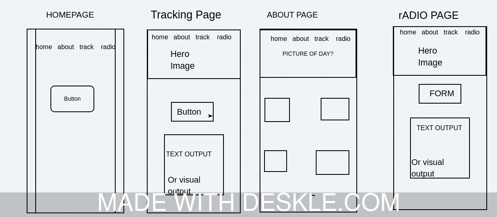

# ISS_Tracker
**Author**: Ashley Casimir, Bobby McPherson, Kim Damalas, and Tyler King
**Version**: 1.0.0 
## Overview
App locates and tracks the International Space Station (ISS), in relation to the user's location, including local weather and visibility. Useful for hobbyiests and enthusiasts everywhere.

## Getting Started
Install the following dependencies: express, cors, pg, ejs, dotenv, morgan (optional), and superagent. 
1. Set up your .env file with the local port, your api key info, and your database url.
1. Setup your database.
1. You might need to set up your schema file?
1. Run code with localhost:port in your browser, where `port` = whatever you set your port to.
## Architecture
<!-- Provide a detailed description of the application design. What technologies (languages, libraries, etc) you're using, and any other relevant design information. -->
1. HTML
1. CSS3
1. Vanilla JS
1. EJS - Server side templating
1. Node.js for the server
1. Express is the framework to let us run a Javascript server
1. Cors - lets us deal with cross broswer scripting and access
1. pg - allows us to create and access SQL database
1. Superagent - necessary to access an API

## Domain Modeling

## Entity Relationship Diagram
this is a test to make sure github is good

## Wireframes
