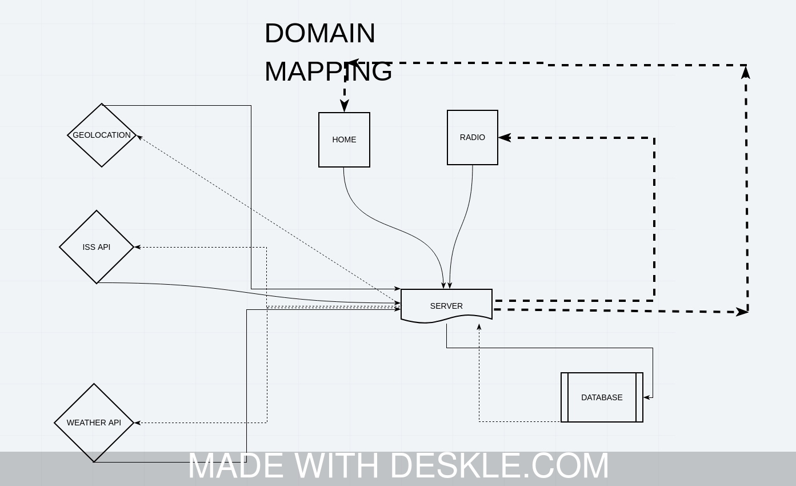
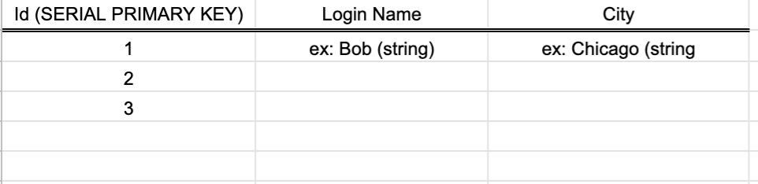
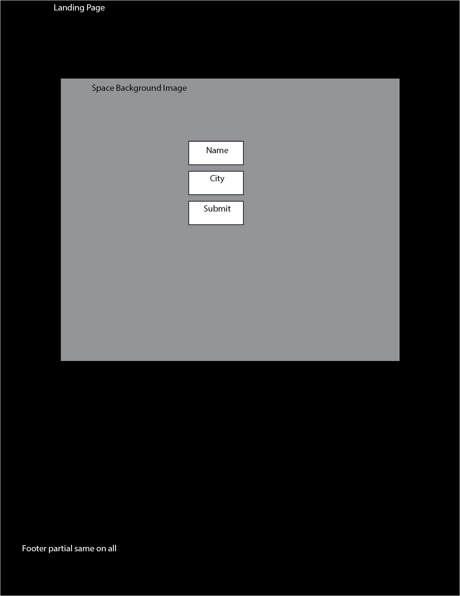
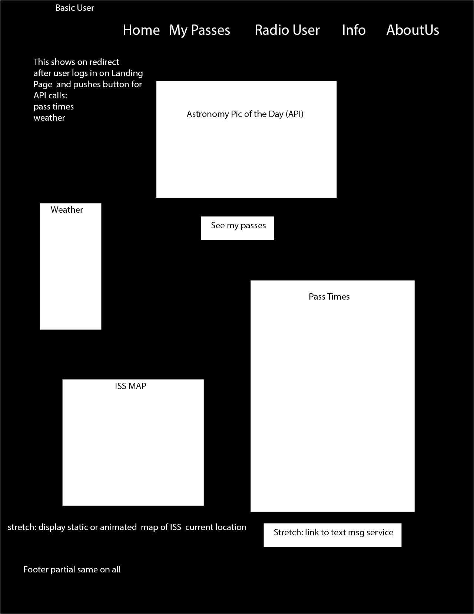
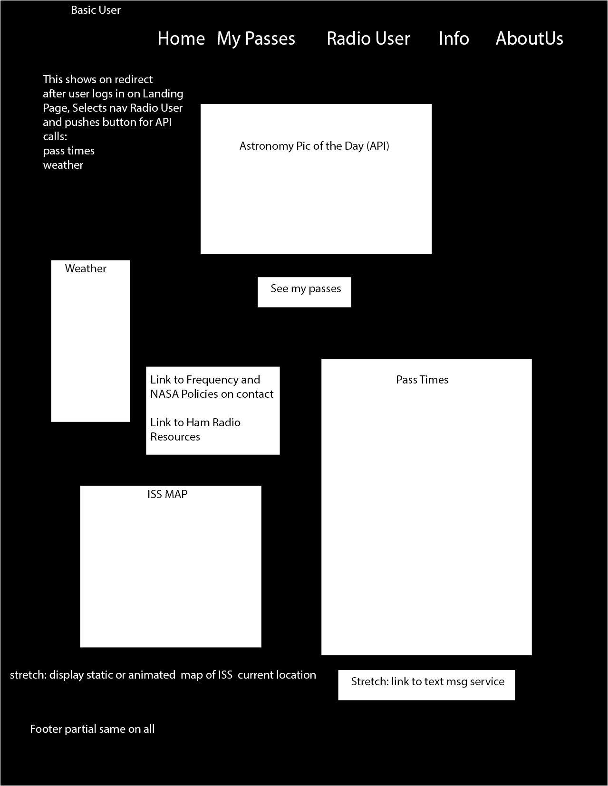
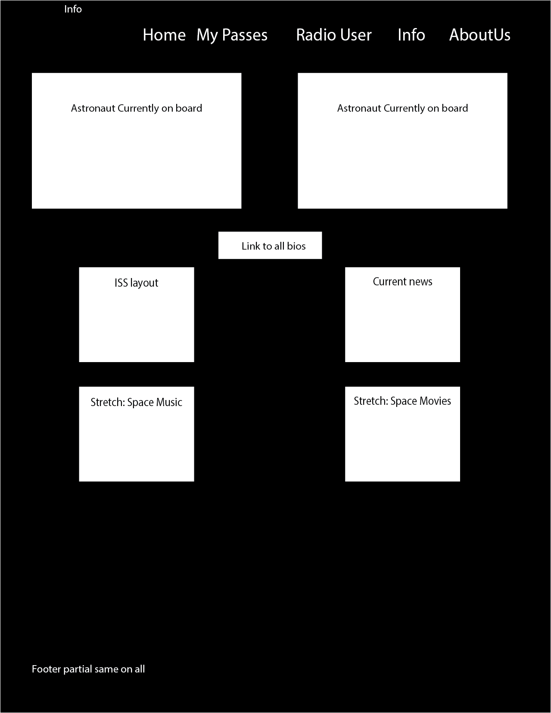
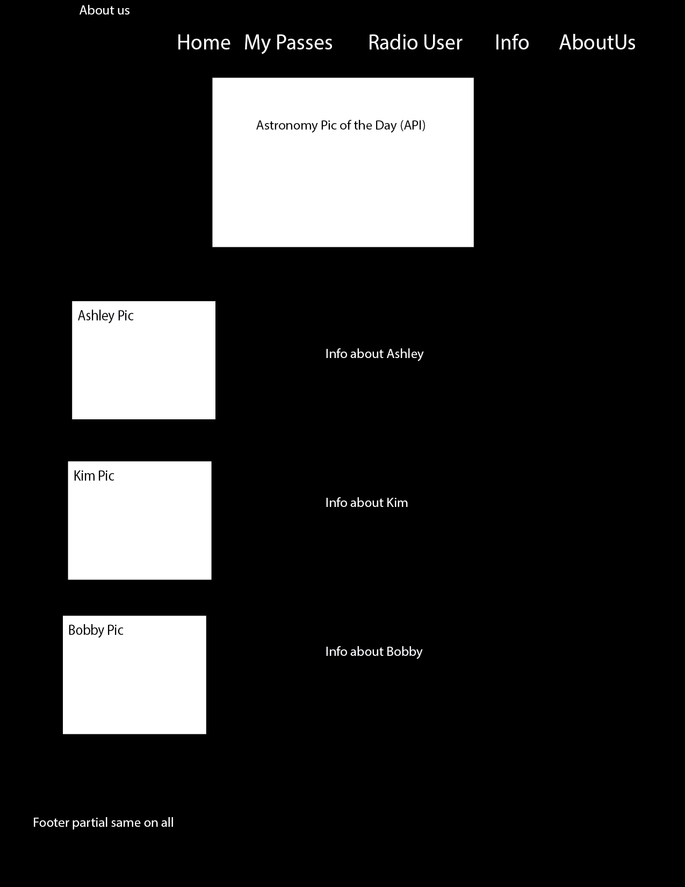

# ISS_Tracker
**Author**: Ashley Casimir, Kim Damalas, Bobby McPherson
**Version**: 1.0.0 
## Overview
App locates and tracks the International Space Station (ISS), in relation to the user's location, including local weather and visibility. Useful for hobbyiests and enthusiasts everywhere as it provides extra information for ham radio users and a fun facts page.

## Trello Board
[ISS Tracker Trello](https://trello.com/b/4vVly6p5/iss-tracker)

## Getting Started
Install the following dependencies: express, cors, pg, ejs, dotenv, morgan (optional), and superagent. 
1. Set up your .env file with the local port, your api key info, and your database url.
1. Setup your database.
1. You might need to set up your schema file?
1. Run code with localhost:port in your browser, where `port` = whatever you set your port to.
## Architecture
<!-- Provide a detailed description of the application design. What technologies (languages, libraries, etc) you're using, and any other relevant design information. -->
1. HTML
1. CSS3
1. Vanilla JS
1. EJS - Server side templating
1. Node.js for the server
1. Express is the framework to let us run a Javascript server
1. Cors - lets us deal with cross broswer scripting and access
1. pg - allows us to create and access SQL database
1. Superagent - necessary to access an API

## Domain Modeling

## Databse Entity Relationship 

We have a database, ISS_Tracker, with one table,  savedTracker.  The table is used to save login name and city.  Users are required to enter these 2 pieces of info before they can access the site.

Stretch: we will likely pull login name from the DB and display on the User Page (Basice and Radio) or in the Nav Partial on all pages to make the site more friendly.

Stretch: we will likely pull login city when user revisits the page and confirm it's still applicable.

Stretch: we may provide the user the ability to save Astronomy Pics of the Day urls as they wish.  This would be a separate table with user name and several slots (5, 8, 10?) for storing and retrieving URLs. Additional Stretch:  provide a page to view saved pics

## Wireframes

